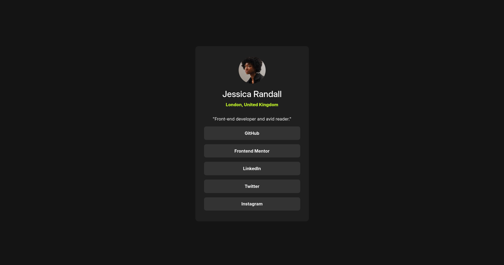

# Frontend Mentor - social links profile solution

This is a solution to the [social links profile challenge on Frontend Mentor](https://www.frontendmentor.io/challenges/social-links-profile-UG32l9m6dQ) 

### Screenshot

### Links
Live site: [Here](frontendmentor-social-link-albrrak773)

### Buildt with
* basic HTML & CSS
* used flexbox for the layout

### What I learned
Not much, This is a pertty simple design
### Useful resources
* [The Frontedn Mentor Challenges Page](https://www.frontendmentor.io/challenges/social-links-profile-UG32l9m6dQ) - This the website I got this challenge from
